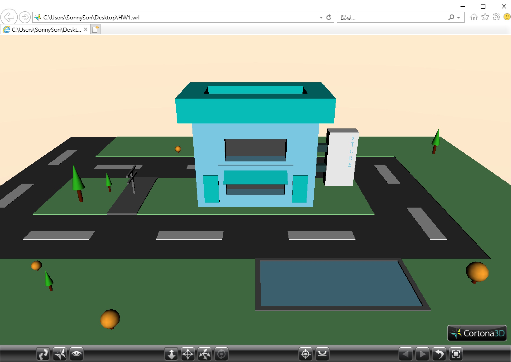

# VRML Language - HomeWork of Computer Animation

**作品名稱：** 採用VRML的3D繪圖練習

**動機：** 該作品為本人在修讀電腦動畫課程時的其中一項作業。在修讀過程中，教授為了讓我們更加了解電腦呈現影像時(舉凡2D或3D)，中間都會有中介語言，作為高階語言與繪圖間的橋樑，以利了解電腦繪圖的基本元素構成畫面的核心想法，故特別給予VRML的練習。雖然，VRML已成為時代的眼淚，但繪圖理念雷同電腦圖學。

**使用語言：** VRML

**開發環境：** Microsoft IE、Cortona 3d viewer

**題目解說：** 為了全面的去練習各種繪畫元件，自己選擇了以城市街景作為構圖的標的，並希望以一種較為cub的方式，來呈現該畫面。因此，以一個較為歐美的場景，在主要幹線道路旁的類快餐店作為繪圖主軸。

**運行方式：** 請確認電腦具有開發環境所需的軟體後，直接點選檔案(HW1.)即可。開啟後，可透過Cortona 3d viewer的功能選單，對於3D畫面進行平移、旋轉、放大與縮小等操作。

**作品呈現：** 
 

	

 
